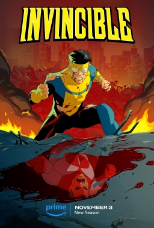

# me-in-mark--down

## Introduction
Hello my name is Aiden , im currrently a sophmore, and I like to draw, a lot. And I can draw both digitally and physically incase if you were wondering.

## Favorite Book/TV Show/Movie

My favorite televsion series is Invincible downright, but I'm currently trying to read all of Hunter X Hunter I have 20 out of the 37 volumes. My favorite movie is probably Aliens or Deadpool & Wolverine.

## Playlist:
[comp sci playlist](https://open.spotify.com/playlist/28A6Hc2GrKxd9buLGZUpm4?si=BA-kgG2JRfK2K48TU2U8Mg&pi=DlkfkXWQQDS7E&nd=1&dlsi=266ecdd454d14162) 

 This playlist has songs that I have enjoyed a lot over the past year and have shaped up to be some of my favorites. Among these mostly contain the genre of Rap which has been a favorite of mine for quite the time. Although my favorite artist is Bad Bunny.

## Creative Endeavors

In my spare time if I'm not watching TV or playing video games I'm drawing. Now I did infact bring that up earlier but here's a background on how I gained that hobby. As a kid I would always doodle on my homework or class assignments as a normal person. But I didnt just want to doodle on the side of papers, I wanted to make drawings that could fill up the whole page. So I would on my spare time draw whatever I came up with, and overtime I would learn to improve and watch youtube on tips for how to improve on things such as shading and how to add proportions along with scaling. And here I am currently learning digital art which has been fun, I enjoy it more than the traditional way of doing things.

My most recent drawing.

## Mood Board

Here is the link to the moodboard.

[moodboard link](https://www.canva.com/design/DAGwqvgmHqI/8oUwz57hOwO44stGwM8Psg/edit)